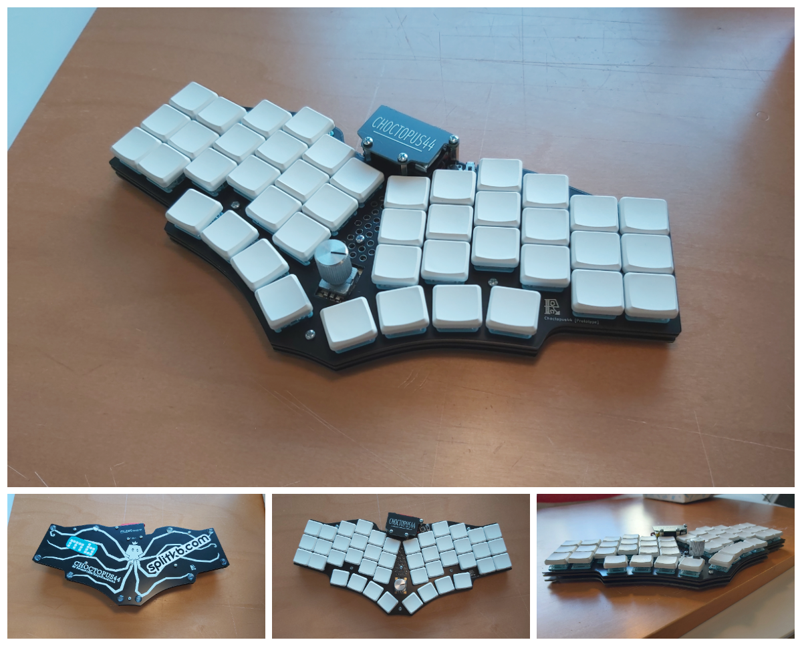

# CHOCTOPUS44

The CHOCTOPUS44 is 44-key column staggered keyboard with a rotary encoder.

## Parts list

| Part                                          | Count | Optional |
| --------------------------------------------- |:-----:|:--------:|
| PCB                                           | 1     |          |
| Top plate [PCB]                               | 1     | x        |
| Bottom plate [PCB]                            | 1     |          |
| M2 stand off 5mm                              | 6     |          |
| M2 stand off 11mm                             | 2     |          |
| M2 stand off 12mm                             | 1     |          |
| M2 screw 3mm                                  | 12    |          |
| M2 screw 8mm                                  | 3     |          |
| M2 screw 10mm                                 | 3     |          |
| Rubber feet                                   | 6-12  |          |
| Diode [1N4148 SMD or THD]                     | 45    |          |
| Kailh Choc sockets                            | 44    | x        |
| Tactile switch Omron B3F or compatible        | 1     |          |
| Slide switch C&K JS202011CQN or compatible    | 1     | x        |
| EC11 encoder                                  | 1     |          |
| ProMicro/Nice!Nano or compatible              | 1     |          |
| MCU socket (or header rows)                   | 1 (2) |          |
| Extra single pin header sockets               | 2     | x        |
| Kailh Choc key switch                         | 44    |          |
| Choc spacing compatible keycaps (e.g. MBK)    | 44    |          |
| Cable for MCU                                 | 1     |          |

### Notes

 * Single pin sockets and the slide switch are only have an use case if you plan on using a Nice!Nano or equivalent, since their use case is only battery related.
 * The length of the required stand-offs is highly dependant on the used battery (assuming one is used at all), MCU socket, and other such parts. With the listed screws and stand offs, a 5mm thick battery can fit between the MCU and the MCU cover without much issue as long as the the MCU socket is slim enough.
 * Using the listed slide switch requires scratching two traces and some hand wiring thanks to a mistake I made while reading datasheets. Reference pictures TBA.

## Firmwares

 * QMK: https://github.com/SlightHeadache/qmk_firmware
 * ZMK (semantically incorrect WIP): https://github.com/SlightHeadache/zmk

## Known issues
 * Slide switch requires hand wiring (see notes)
 * Potentially flaky Bluetooth behaviour?
   * Could be a Samsung A51 specific issue
   * Could be caused by malfunctioning Nice!Nano, the unit has had a hard life

[Build guide TBA]
